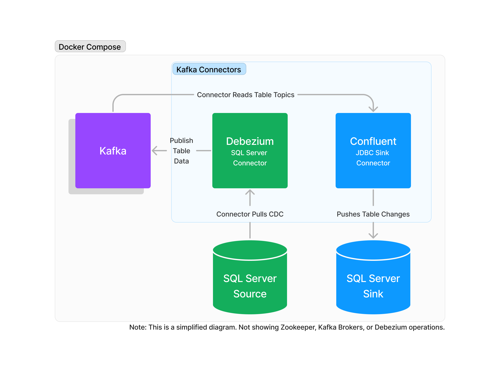

# Database table replication via Kafka

This is an example project showing how to replicate data from a source SQL database to a sink SQL database using Kafka, Kafka Connect, and Debezium.

## Included in this project

- Docker containers for Microsoft SQL Server, Zookeeper, Kafka, Kafka Connect, Kafka UI, and Debezium
- How to enable CDC on Microsoft SQL Server
- Debezium Microsoft SQL Server connector
- Write CDC changes to Kafka topics using Debezium SQL Server connector.
- Write CDC changes to sink database to finish full replication procedure.

## Getting Started

1. Install Prerequisites
    - Terminal - Linux (Mac, Ubuntu, etc.) or Linux over WSL (Windows)
    - Install [Docker Desktop](https://www.docker.com/products/docker-desktop/) (integrates with WSL for Windows)
    - Install [Azure Data Studio](https://azure.microsoft.com/en-us/products/data-studio) (or a SQL Server client of your choice)
2. From terminal, `docker-compose build && docker-compose up`
3. Create Source & Sink connections in Azure Data Studio:
    - host: `localhost`
    - port: `1433` (source) & `1434` (sink)
    - user: `sq`
    - password: `Imgoingtotellalongstory123!@#`
4. Azure Data Studio, open & execute files:
    - `src/source/mssql_source_init.sql`
    - `src/sink/mssql_sink_init.sql`
5. From terminal run:
    - `bin/create_source.sh`
    - `bin/create_sink.sh`
6. In Azure Data Studio, on `Sink` connection you should now see Products table replicated from the `Source` database.
    - `select * from Products`
7. To brown the Kafka topics, open browser to [http://localhost:8080](http://localhost:8080)

## Notes
- This project is not secure or production ready and therefore only intentended for educational purposes. You will need to use a secrets manager, trusted network communication, and production quality settings to transition to reliable use.
- For SQL Server, materialied views are not supported in data replication as a limitation of SQL Server CDC.
- JDBC Sql Sever Connection reference: `jdbc:sqlserver://<server>:<port>;databaseName=Test;user=<user>;password=<password>`

## Resoures
- [Enable CDC on SQL Server](https://learn.microsoft.com/en-us/sql/relational-databases/track-changes/enable-and-disable-change-data-capture-sql-server?view=sql-server-ver16) (article)
- [Debeium Database Replication via Kafka](https://debezium.io/blog/2017/09/25/streaming-to-another-database/) (article)
- [Debezium SQL Server Connector](https://debezium.io/documentation/reference/stable/connectors/sqlserver.html) (reference)
- [Confluent Sink Connector for JDBC](https://docs.confluent.io/kafka-connectors/jdbc/current/sink-connector/overview.html) (reference)

## Terms
- Source - the database read authorty
- Sink - a destination database consuming the replicating the source
- Kafka - event streaming platform
    - Broker - Responsible for receiving and sending the messages, it consists in two parts: topics and partitions.
    - Topic - It’s an identifier used to organize the message into categories.
    - Partitions - A subdivision of a topic to organize and balance the data.
    - Kafka cluster - A cluster set, being the main instance of Kafka.
    - Producer - The source of the data, send and distribute the logs.
    - Consumer - Consumers subscribe to a topic and listen to them all the time, receiving logs.
    - Additional Kafka components:
        - Kafka Connectors
        - Kafka Transformers
        - Kafka Converters
- Debezium - an open source distributed platform for change data capture that converts information from your existing databases into event streams, enabling applications to detect, and immediately respond to row-level changes in the databases
